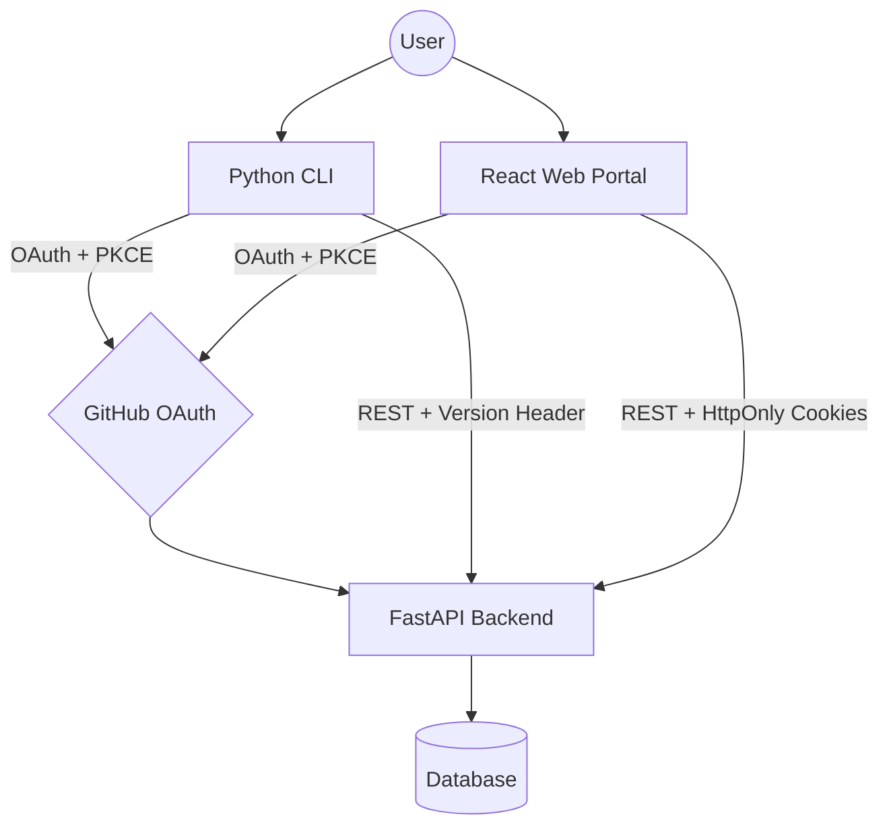

# Insighta Labs+ Web Portal

A secure, role-based web interface for the Insighta Labs+ Profile Intelligence Platform.

## Live URLs

- **Web Portal:** https://insighta-frontend-nu.vercel.app
- **Backend API:** [https://hng-stage-3-backend.vercel.app](https://hng-stage-3-backend.vercel.app/)

---

## System Architecture
### System Architecture


Note:*This diagram represents the full Insighta ecosystem. This repository handles the Web portion of the architecture. I tried using <a href="https://mermaid.js.org" target="_blank" rel="noopener noreferrer">mermaid editor</a> to create this*


#### The platform is split into three independent parts:

GitHub OAuth -> FastAPI Backend (Python) -> Client:React Web Portal (this repo) and CLI


- The **backend** handles all auth, data, and business logic
- The **web portal** is a React SPA that talks to the backend via REST
- The **CLI** (separate repo) shares the same backend
- All three interfaces use one source of truth — the same database and API

---

## Auth Flow

The web portal uses GitHub OAuth with PKCE:

1. User clicks "Continue with GitHub"
2. Browser is redirected to `GET /auth/github` on the backend
3. Backend generates a `state` and `code_challenge`, saves them, redirects to GitHub
4. User authenticates on GitHub
5. GitHub redirects to `GET /auth/github/callback` on the backend
6. Backend exchanges the code, fetches the GitHub user, creates or updates the user record
7. Backend sets two **HTTP-only cookies**: `access_token` and `refresh_token`
8. Browser is redirected to the frontend dashboard
9. Frontend calls `GET /auth/whoami` — if the cookie is valid, the user is returned

Tokens are never accessible to JavaScript. The browser sends them automatically on every request.

---

## Token Handling

| Token | Expiry | Storage |
|---|---|---|
| Access token | 3 minutes | HTTP-only cookie |
| Refresh token | 5 minutes | HTTP-only cookie |

**Auto-refresh flow:**
- Every API call goes through an Axios interceptor
- If a `401` is returned, the interceptor calls `POST /auth/refresh` before giving up
- If refresh succeeds, the original request is retried transparently
- If refresh fails (both tokens expired), the user is redirected to `/login`
- Multiple simultaneous `401`s are queued — only one refresh call is made

---

## Role Enforcement

Two roles exist: `admin` and `analyst`. Default role on signup is `analyst`.

| Action | Admin | Analyst |
|---|---|---|
| View profiles | ✓ | ✓ |
| Search profiles | ✓ | ✓ |
| Export CSV | ✓ | ✓ |
| Create profiles | ✓ | ✗ |
| Delete profiles | ✓ | ✗ |

**How it works:**
- The backend enforces roles on every `/api/*` endpoint via FastAPI dependencies (`require_admin`, `require_analyst`)
- The frontend reads `user.role` from the auth context and conditionally renders UI elements (create input, delete buttons) — but this is UI-only, the backend is the real gatekeeper
- If an inactive user (`is_active = false`) tries to access any endpoint, they receive `403 Forbidden`

---

## Natural Language Search

`GET /api/profiles/search?q=young males from nigeria`

The backend parses the query string using a custom parser (`app/parser.py`) that extracts:
- Gender keywords: "male", "female"
- Age group keywords: "young", "adult", "senior", "teenager", "child"
- Country references: country names and codes mapped to ISO codes

The extracted filters are applied to the database query the same way as the standard filter endpoint.

---

## Web Portal Pages

| Route | Description | Access |
|---|---|---|
| `/login` | GitHub OAuth entry point | Public |
| `/` | Dashboard with stats | All users |
| `/profiles` | Profile list with filters, pagination, export | All users |
| `/profiles/:id` | Profile detail view | All users |
| `/search` | Natural language search | All users |
| `/account` | User info, permissions, logout | All users |

---

## Local Development

```bash
# Install dependencies
npm install

# Set environment variable
echo "VITE_API_BASE_URL=http://localhost:8000" > .env

# Start dev server
npm run dev
```

The portal runs at `http://localhost:5173`.

---

## Tech Stack

- React 18 + Vite
- React Router v6
- Axios with request/response interceptors
- CSS Modules
- GitHub OAuth via backend (PKCE flow)


> **Note for admins:** All new users are assigned the `analyst` role by default. 
> To test admin features, update the role directly in the database:
> ```sql
> UPDATE users SET role = 'admin' WHERE username = 'your-github-username';
> ```

